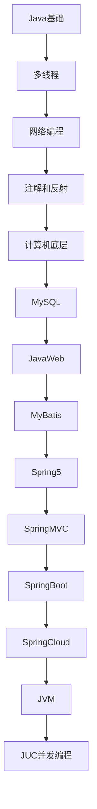

```mermaid
graph TD
    Java基础 --> 多线程
    多线程--> 网络编程
    网络编程 --> 注解和反射
    注解和反射 --> 计算机底层
    计算机底层 --> MySQL
    MySQL --> JavaWeb
    JavaWeb --> MyBatis
    MyBatis --> Spring5
    Spring5 --> SpringMVC
    SpringMVC --> SpringBoot
    SpringBoot --> SpringCloud
    SpringCloud --> JVM
   JVM --> JUC并发编程
```